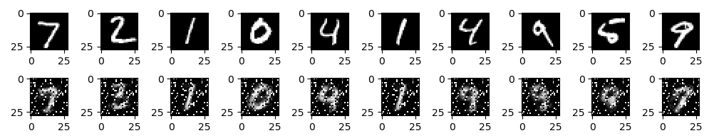

# Dimensionality-Reduction-with-Autoencoder
Autoencoders can be used for feature extraction and dimensionality reduction. They can also be combined with Restricted Boltzmann Machines to employ deep learning applications like Deep Belief Networks.

It has Encoder and Decoder phases, Encoder compresses the input in a step by step process, it selects the most important features during compression. Decoder is opposite of encoder as it works to recreate the input as closely as possible.

## Requirements
- Python 3.6 and above
- TensorFlow 1.6.0 and above
- Numpy
- Matplotlib

## Implementation
The implementation uses MNIST dataset to reconstruct the input. 

As MNIST images are of shape 28\*28 so input is 784.
Our model would be 3 layered reducing features by each layer and reconstructing the inut in the decoder phase,

```       
        Encoder                            Decoder  
[784] -> [256] -> [128] -> [64] -> [128] -> [256] -> [784]
```

The end result for this implementation contains lot of noise as show below.

This can be improved by implemeneting a Variational Autoencoder for reconstructing the input better ([Ref](https://arxiv.org/pdf/1512.09300.pdf)).
